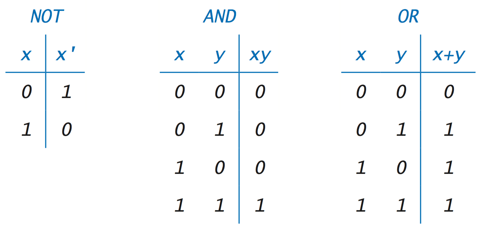

## **[Succeeded With 77%] - C00**

C00 ile C programlaya giriş yapıyorsunuz. Buradan sonra algorima kurmaya ve kod yazmaya başlıyorsunuz. Benden size öneri kodları ezberlemeye çalışmayın, kodların nasıl çalıştığını örnenin. Siz zaten kodları kullandıkça öğreniyorsunuz hepsini _(ör: Elmanın elma olduğunu ezberlemediniz. Elma kelimesini kullandıkça kafanızın içinde yer etti. Bırakın kodlarda kafanızda bu şekilde yer etsin)_

## Temeller
* ### Değişkenler(variables)
	Değişkenler bizim için çeşitli verileri tutan nesnelerdir. Farklı veri tipleri için farklı değişkenler oluşturur ve bunları isteğimize göre değiştiririz. Her değişkenin alabileceği bir maximum/minimum değeri vardır. Ağağıda verdiklerim hepsi olmasada piscine boyunca kullanacağınız değişkenler.
	* int(integer) -> Tam sayı tutar. 4 byte yer kaplar.
		```c
		int a;	//min degeri -2,147,483,648
		a = 5;	//max degeri 2,147,483,647
		```
	* unsigned int -> Pozitif Tam sayı tutar. 4 byte yer kaplar.
		```c
		unsigned int a;	//min degeri 0
		a = 5;			//max degeri 4,294,967,295
		```
	* char(character) -> Karakterleri tutar. 1 byte yer kaplar.
		```c
		char a;		//min degeri -127
		a = 'a';	//max degeri 127
		// unsigned char 0 - 255
		```
	* float(floating point) -> Ondalık sayıları tutar. 4 byte yer kaplar.
		```c
		float a;	//min degeri -3.402823e+38
		a = 5.5;	//max degeri 3.402823e+38
		```

* ### Operatorler
	Operatörler atama, karşılaştırma veya matematiksel işlemler için kullanılırlar.
	* Atama Operatorleri.
\
	Atama operatörleri, değişkenlerin değerlerini değiştirir.
		| Operator | Örnek _a = 5 olsun_ | İşlevi |
		|	:--	|	--	|	-:	|
		|  = | a = 5 >> 5 | Sağındakidaki sonucu solundakine atar. |
		| += | a += 5 >> 10 |Sağındakidaki sonucu solundakine ekler. |
		| -= | a -= 5 >> 0 |Sağındakidaki sonucu solundakinden çıkarır. |
		| *= | a *= 5 >> 25 |Sağındakidaki sonucu solundakine çarpar. |
		| /= | a /= 5 >> 1 |Sağındakidaki sonucu solundakine böler. |
		| %= | a %= 5 >> 0 |Sağındakidaki sonucu solundakine mod alır. |
	* Aritmetik Operatörler.
\
	Matematik işlemlerini yapmamızı sağlar.
		| Operator | Örnek _a = 5 olsun_ | İşlevi |
		|	:--	|	--	|	-:	|
		|  + | a + 5 >> 10 |Sağındaki sonucu solundakine ekler. |
		|  - | a - 5 >> 0 |Sağındakidaki sonucu solundakinden çıkarır. |
		|  * | a * 5 >> 25 |Sağındakidaki sonucu solundakine çarpar. |
		|  / | a / 5 >> 1 |Sağındakidaki sonucu solundakine böler. |
		|  % | a % 5 >> 0 |Sağındakidaki sonucu solundakine mod alır. |
	* Karşılaştırma Operatörleri.
\
	Karşılaştırma operatörleri, değişkenlerin değerleri karşılaştırır. Eğer doğruysa 1(ture) değilse 0(false) verirler.
		| Operator | Örnek _a = 5 olsun_ | İşlevi |
		|	:--	|	--	|	-:	|
		| == | a == 5 >> 1 | İki değerin eşit olup olmadığını kontrol eder. |
		| != | a != 5 >> 0 | İki değerin eşit olmadığını kontrol eder. |
		| <  | a < 5 >> 0|İki değerin büyük olup olmadığını kontrol eder. |
		| >  | a > 3 >> 1|İki değerin küçük olup olmadığını kontrol eder. |
		| <= | a <= 5 >> 1|İki değerin büyük veya eşit olup olmadığını kontrol eder. |
		| >= | a >= 7 >> 1|İki değerin küçük veya eşit olup olmadığını kontrol eder. |
	* Mantıksal Operatörler.
\
	Mantıksal operatörler aynı anda birden fazla karşılaştırma operatörü kullanmamıza yarar. Koşul Eğer doğruysa 1(ture) değilse 0(false) verirler
		| Operator | Örnek _a = 5 olsun_ | İşlevi |
		|	:--	|	--	|	-:	|
		| && | a == 5 && a == 3 >> 0 | ve |
		| \|\| | a == 5 \|\| a == 3 >> 1 |veya |
		| !  | !a >> 1 | değil |

		bu operatörleri anlamanız için aşağıdaki tabloyada bakabilirsiniz.
	


* ### Koşullar(if)
	if yanına yazdığımız koşul doğru ise if bloğunun içindeki kodları çalıştırır, doğru değilse else bloğunun içindeki kodları çalıştırır _(else yoksa hiçbirşey çalışmaz)_.
	```c
	int a = 3;
	if(a == 3){				// burası a degeri 3 mü diye bakıyor.
		printf("a = 3");	//eger doğru ise a = 3 yazdırıyor.
	}
	else{
		printf("a != 3");	//eger yanlış ise a != 3 yazdırıyor.
	}
	```

* ### Döngüler(loops)
	Benzer işlemleri birçok defa uygulicaksak bu işlemleri döngüye alırız ve döngü içinde istediğimiz gibi değiştiririz. Bu sayede aynı satırları tekrar tekrar yazmaya gerek kalmaz.
	* While -> Bir döngü çeşitidir, yanında verdiğiniz şart True(1) sonucunu verdiği sürece döngüyü sürdürür.
		```c
		int i = 0;
		while(i < 10)			//bu döngü i<10 olduğu sürece devam edicek
		{
			printf("%d\n", i);	// <- burası her seferinde i'nin değerini yazdırır.
			i++;				// i, 1 artırılır.
		}
		```
		yukarıdaki kod 0dan 9a kadar 10 adet rakamı yazdırır.
* ### Fonksiyonlar(functions)
	Fonksiyonlar istediğiniz yerden erişebildiğiniz yapılardır. Fonksiyonların içine istediğiniz kodu yazabilirsiniz.  Dışarıdan parametle alabilirler. Fonksiyonların tipleri vardır, bir fonksiyon tipi her ne ise o tipde bir değer return etmek zorundadır. eğer tipsiz(void) ise herhangi bir şey return edemezler.
	```c
	int fonksiyon_adi(int c)	//burada fonksiyonumuzu tanımladık. fonksiyonu
	{							//çağırırken içine bir integer değer istediğimizi belirttik
		c = 10;					//aldığım değeri 10 olarak belirleyip
		return (c);				//yeni değerini geri döndürdük.
	}
	int main()
	{
		int a = 5;
		printf("%d\n", fonksiyon_adi(a));	//ekrana 10 yazdırır.
		return (0);
	}
	```
	fonksiyonu çağırdığınızda fonksiyon bitene veya siz fonksiyondan çıkana kadar fonksiyonun içeriği yapılır daha sonra kalan yerden devam eder.

## Fonksiyon/Kodlar
* ### include
	Include ile kodumuza kütüphane ekleriz. Kütüphaner içlerinde faydalı ve kullanışlı fonksiyonlar bulundururlar.
	```c
	#include <kütüphane>
	```
* ### write
	```unistd.h``` kütüphanesi ile gelen bir yazdırıcıdır. Bunu kullanarak çıktımızı dosyaya veya terminal ekranına yazdırabiliriz.
	```c
	write(int fd, const void *buf, size_t count);
	```
	* fd -> Dosya veya terminal numarası
	* *buf -> Yazdırılacak verinin adresi _(Verinin adresini &degisken olarak gösteririz)_
	* count -> Yazdırılacak verinin uzunluğu
